## 目录
- [介绍](#介绍)
- [面包板](#面包板)
- [杜邦线](#杜邦线)
- [本征半导体](#本征半导体)
- [杂质半导体](#杂质半导体)
- [PN结](#PN结)
- [二极管](#二极管)
- [发光二极管——LED](#发光二极管)
- [彩色LED](#彩色LED)
- [彩色LED灯带](#彩色LED灯带)
- [电阻器](#电阻器)
- [电位器](#电位器)
- [电容器](#电容器)
- [电感器](#电感器)
- [温湿度传感器](#温湿度传感器)
- [气压传感器](#气压传感器)
- [光照传感器](#光照传感器)
- [颜色传感器](#颜色传感器)
- [紫外线传感器](#紫外线传感器)
- [运动传感器](#运动传感器)
- [姿态传感器](#姿态传感器)
- [振动传感器](#振动传感器)
- [距离传感器](#距离传感器)
- [接近传感器](#接近传感器)
- [存在传感器](#存在传感器)
- [气体传感器](#气体传感器)
- [空气质量传感器](#空气质量传感器)
- [粉尘传感器](#粉尘传感器)
- [触摸传感器](#触摸传感器)
- [压力传感器](#压力传感器)
- [力传感器](#力传感器)
- [重量传感器](#重量传感器)
- [流量传感器](#流量传感器)
- [液位传感器](#液位传感器)
- [湿度传感器](#湿度传感器)
- [土壤传感器](#土壤传感器)
- [声音传感器](#声音传感器)
- [磁场传感器](#磁场传感器)
- [电流传感器](#电流传感器)
- [电压传感器](#电压传感器)
- [功率传感器](#功率传感器)
- [心率传感器](#心率传感器)
- [血氧传感器](#血氧传感器)
- [GPS模块](#gps模块)
- [陀螺仪](#陀螺仪)
- [加速度计](#加速度计)
- [磁力计](#磁力计)
- [红外传感器](#红外传感器)
- [激光传感器](#激光传感器)
- [雷达传感器](#雷达传感器)
- [摄像头模块](#摄像头模块)
- [编码器](#编码器)
- [直流电机](#直流电机)
- [步进电机](#步进电机)
- [舵机](#舵机)
- [振动电机](#振动电机)
- [继电器](#继电器)
- [电磁铁](#电磁铁)
- [LED灯](#led灯)
- [OLED显示屏](#oled显示屏)
- [LCD显示屏](#lcd显示屏)
- [数码管](#数码管)
- [蜂鸣器](#蜂鸣器)
- [扬声器](#扬声器)
- [麦克风](#麦克风)
- [蓝牙模块](#蓝牙模块)
- [WiFi模块](#wifi模块)
- [LoRa模块](#lora模块)
- [ZigBee模块](#zigbee模块)
- [NB-IoT模块](#nb-iot模块)
- [4G模块](#4g模块)
- [RFID模块](#rfid模块)
- [NFC模块](#nfc模块)
- [红外通信](#红外通信)
- [以太网模块](#以太网模块)
- [CAN总线模块](#can总线模块)
- [RS485模块](#rs485模块)
- [ADC模块](#adc模块)
- [DAC模块](#dac模块)
- [运算放大器](#运算放大器)
- [比较器](#比较器)
- [电压基准](#电压基准)
- [电源管理](#电源管理)
- [电池管理](#电池管理)
- [升压模块](#升压模块)
- [降压模块](#降压模块)
- [稳压模块](#稳压模块)
- [光耦隔离](#光耦隔离)
- [电平转换](#电平转换)
- [信号调理](#信号调理)
- [滤波器](#滤波器)
- [放大器](#放大器)
- [计数器](#计数器)
- [定时器](#定时器)
- [时钟模块](#时钟模块)
- [存储模块](#存储模块)
- [逻辑芯片](#逻辑芯片)
- [微控制器](#微控制器)
- [开发板](#开发板)
- [扩展板](#扩展板)
- [转接板](#转接板)
- [连接器](#连接器)
- [线缆](#线缆)
- [散热器](#散热器)
- [外壳](#外壳)

---

## 介绍
欢迎来到硬件模块的实战指南。这里整理了从基础元件到各类硬件的原理、接线方法和代码示例，适合电子爱好者、嵌入式开发者快速查阅与应用。没有复杂的理论堆砌，只有清晰明了的实践指引，助你轻松动手，玩转硬件。

## 面包板
电路的实验沙盘，无需焊接，用杜邦线在孔阵间搭建临时电路。这里是验证想法最快捷的试验场，是硬件开发者最忠实的草稿纸：

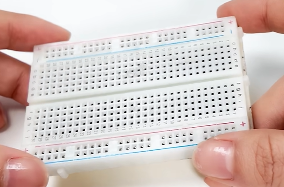
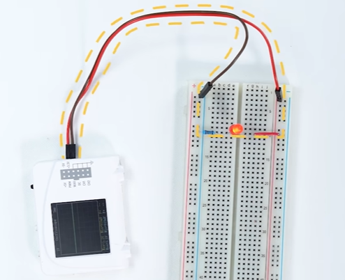


连续线段表示联通
- 中间的是5个插孔横向联通，联通的方式是通过图中的连排小夹子实现的
- 左右两列+-常用做电源和接地，纵向全部联通

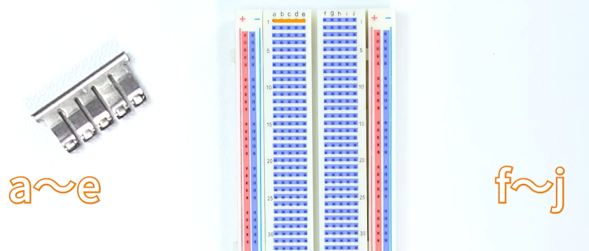


参考视频
- [还不知道面包板怎么用？保姆级解说让电子小白快速入门](https://www.bilibili.com/video/BV1Ji42197sp/)


## 杜邦线
相当于导线
- 有公头和母头之分
- 常和面包板搭配，可以灵活的进行电路搭建

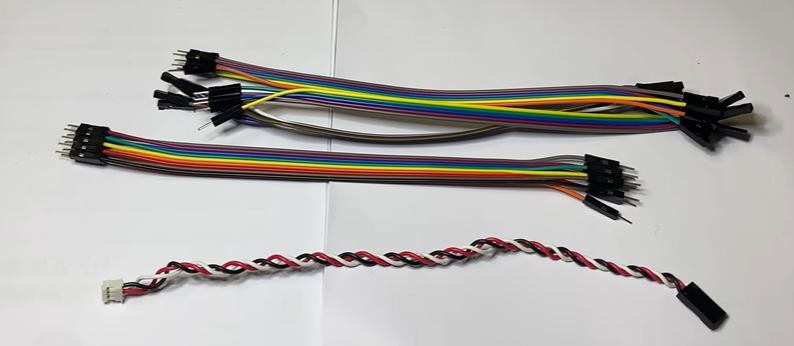
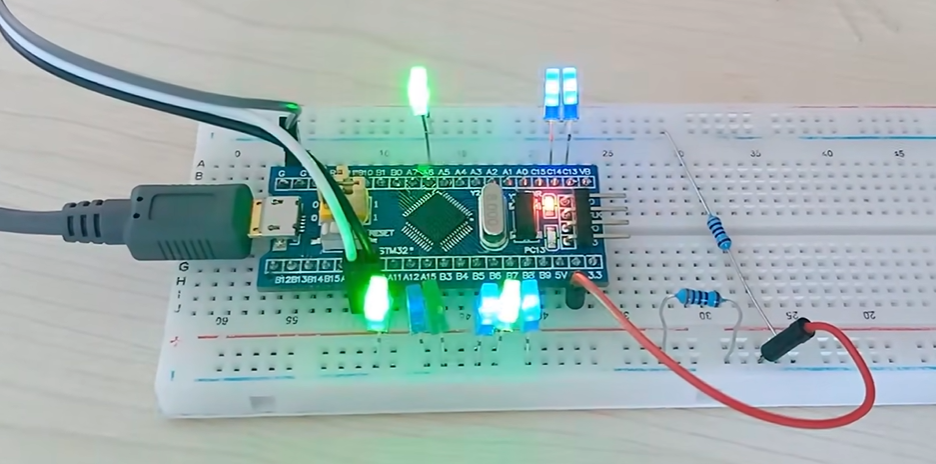

参考视频
- [杜邦线的使用方法](https://www.bilibili.com/video/BV15C411b7nj/)


## 本征半导体
本征半导体是所有半导体技术与器件的理论起点和性能参照基准。其纯净结构下热激发产生电子-空穴对的行为，是理解掺杂、PN结及晶体管工作原理的根本基础。

- 概念：是一种纯净的具有晶体结构的半导体
- 常用：硅、锗。这些四价原子最外层有4个电子，原子之间能形成共价键，从而达到一个稳定的结构
    - 
- 晶体结构
    - 像东方明珠，正四面体
    - 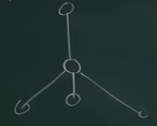
- 载流子
    - 包含：自由电子和空穴。
    - 本征激发：只要不是绝对零度，电子就会存在热运动，就可能挣脱束缚成为自由电子。
    - 空穴：是共价键中电子挣脱后留下的、带正电的空缺。它的运动本质是相邻电子的依次填补。等效为一个具有正电荷的载流子。
    - 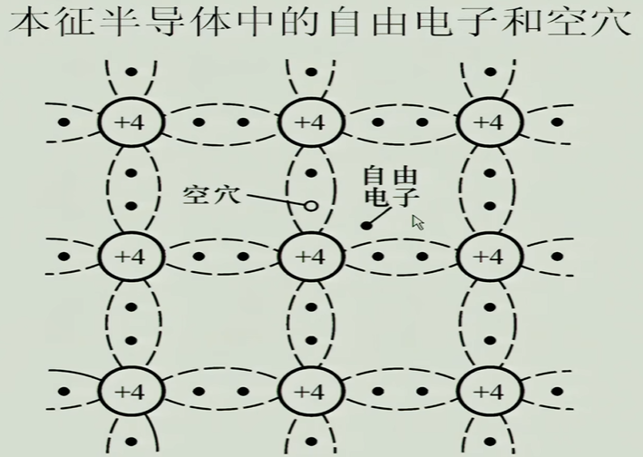


参考视频
- [模拟电子技术基础 01-绪论](https://www.bilibili.com/video/BV1Gt411b7Zq/)


## 杂质半导体
杂质半导体是通过向本征半导体中掺入特定杂质，从而人为控制其导电类型（N型/P型）和导电能力的关键材料，是所有半导体器件的物理基础。

- 概念：掺入**少量**杂质元素，少量不会改变晶体结构
- N型半导体：掺入少量磷（P）
    - 
    - 多子：多数载流子，这里是自由电子
    - 少子：少数载流子，这里是空穴
- 杂质半导体（N型/P型）的类型：是根据其**多数载流子**的电荷性质来定义的。
    - N型（Negative Type）：多数载流子是带负电荷（Negative）的自由电子。
    - P型（Positive Type）：多数载流子是带正电荷（Positive）的空穴。
- 温度影响：温度升高会加剧本征激发，使载流子总数增加。
    - 多数载流子：在常用温度范围内，其浓度由掺杂决定，基本保持稳定。
    - 少数载流子：浓度随温度呈指数上升，是影响器件高温性能的关键。
- 施主原子：贡献载流子的原子
- P型半导体：掺入少量硼（B），引入空穴作为多数载流子。
    - 多子：空穴
    - 少子：自由电子

参考视频
- [模拟电子技术基础 02-PN结的形成](https://www.bilibili.com/video/BV1Gt411b7Zq/?p=2)

## PN结
PN结是“Positive-Negative Junction”的简称，指P型与N型半导体结合形成的交界区域。当两者结合时，在交界面处会形成一个具有单向导电性、宽度稳定的空间电荷区（耗尽层），这就是PN结，它是所有半导体器件的核心结构。


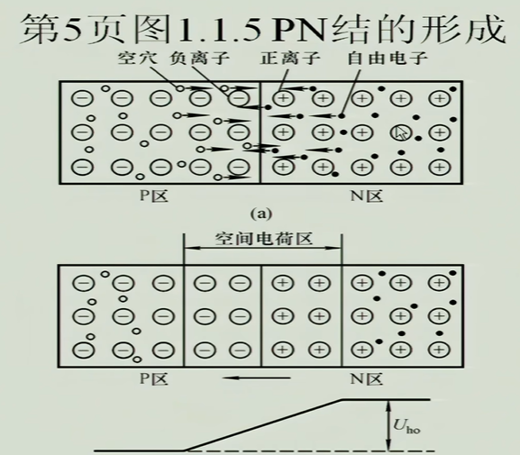

PN结的“平衡”是指 **扩散作用** 和 **漂移作用** 达到动态平衡，可以这样理解这个过程：
1. 扩散开始：
    - 当P型半导体（多空穴）和N型半导体（多电子）刚结合时，P区的空穴会扩散到N区，N区的电子会扩散到P区。
    - 这会在交界处形成一个带电的 “空间电荷区”（也叫耗尽层），P区一侧带负电，N区一侧带正电。
2. 内建电场形成：
    - 这个空间电荷区会产生一个从N区指向P区的内建电场（也叫势垒电场），会阻碍多数载流子的进一步扩散。
3. 产生漂移作用：
    - 这个内建电场会推动带负电的电子向N区运动（漂移），推动带正电的空穴向P区运动（漂移）。
    - 漂移运动的方向正好和之前的扩散运动方向相反。
4. 达到平衡：
    - 开始时，扩散作用强，漂移作用弱。但随着扩散的进行，空间电荷区变宽，内建电场增强，扩散作用变弱，漂移作用变强。
    - 最终，由浓度差驱动的扩散运动 和 由内建电场驱动的漂移运动达到平衡状态，空间电荷区的宽度不再变化。

- 一句话总结：
    - PN结的平衡是“扩散”与“漂移”两种运动力量相等、相互抵消的动态平衡状态。

- 对称结
    - P区和N区掺杂浓度相近。
    - 空间电荷区向两侧延伸宽度相近。

- 不对称结（单边突变结）
    - 一侧浓度远高于另一侧（如P⁺N或PN⁺）。
    - 空间电荷区几乎全部向低浓度一侧延伸，高浓度一侧很薄。（绝大多数实际PN结属于此类） 

- 单向导电性
    - 加正向电压
        - 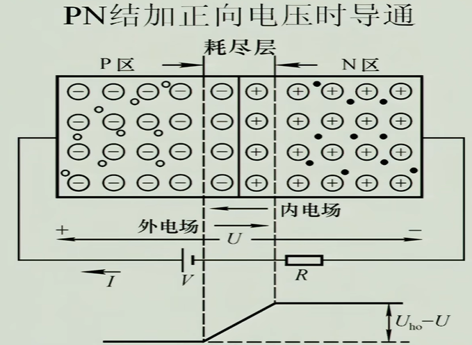
        - 外加电场会削弱内建电场，从而实现导通
        - PN结的导通电流和外部电压**不是线性关系**，外部电压很小时，几乎不导通，称为**死区**，随着电压的加大，通过的电流会指数级增大。
        - PN结内部电阻很小，一旦导通，电流会趋于无限大，热功率P=I*U，发生热击穿，所以要加一个限流电阻。
    - 加反向电压
        - 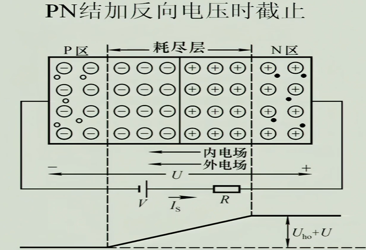
        - PN结变厚，阻挡作用更强，几乎不导电

- PN结的伏安特性
    - 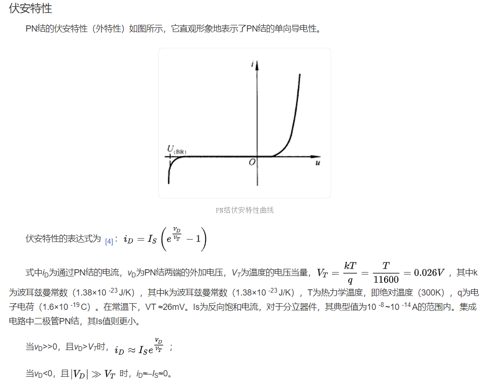
    - 正向：
        - 电压从0开始加，有一个“死区”（硅管约0~0.5V），电流极小；超过约0.7V后，电流像开闸洪水一样指数级暴增。
    - 反向：
        - 电压反着加，电流始终极小（几乎为零），像个绝缘体；但电压加得过高时，会瞬间“击穿”，电流急剧增大。
        - 雪崩击穿：
            - 高电压把载流子“发射”出去，像子弹一样撞出更多载流子，引发雪崩式倍增。

        - 齐纳击穿：
            - 超强电场直接把半导体原子上的电子“撕”下来，瞬间制造大量自由载流子。
            - 应用：稳压二极管


参考资料
- [模拟电子技术基础 02-PN结的形成](https://www.bilibili.com/video/BV1Gt411b7Zq/?p=2)
- [模拟电子技术基础 03-PN结与二极管的特性](https://www.bilibili.com/video/BV1Gt411b7Zq?vd_source=a0ed88162ba357c3f44aa427ad89574b&spm_id_from=333.788.player.switch&p=3)
- [PN结-baike](https://baike.baidu.com/item/PN%E7%BB%93/898090)
- [五分钟带你了解 稳压二极管](https://www.bilibili.com/video/BV1qY4y1t7sc/?spm_id_from=333.337.search-card.all.click&vd_source=a0ed88162ba357c3f44aa427ad89574b)


## 二极管
二极管是一种基本的非线性元件，其核心特性是单向导电性，这使得它在整流、保护、稳压和发光等电路中发挥关键作用。与线性电阻不同，二极管的电压与电流关系不符合欧姆定律，因此需要深入理解其伏安特性和导通规律，才能进行准确的电路分析和设计。

- 常见结构
    - 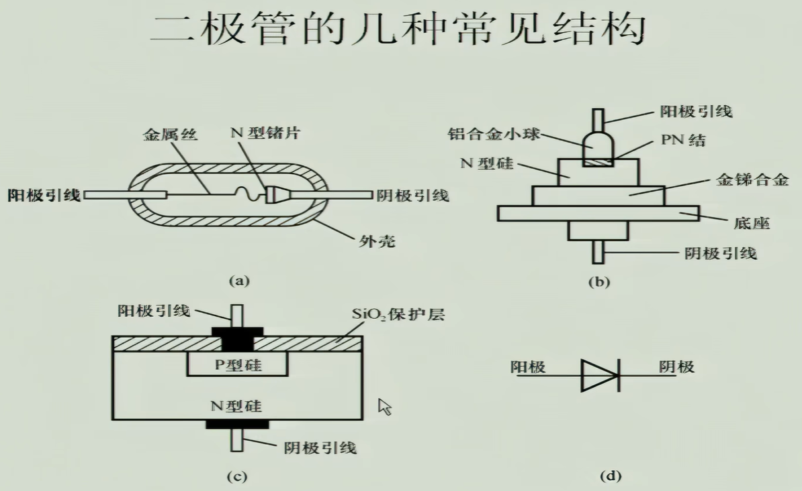
    - （a）：点接触型，金属丝是P
    - （b）：面接触型
    - （c）：平面型，集成芯片基础单元

- PN结和二极管的关系
    - PN结：空间电荷区
    - 二极管：
        - 包含：P区、N区、PN结、P区体电阻、N区体电阻、外壳封装、外壳泄露电流

- 二极管的伏安特性
    - 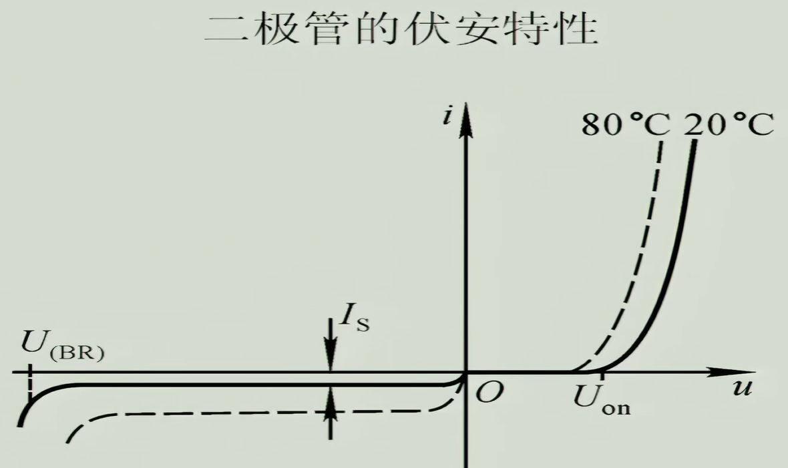
    - 相同电压下电流比PN结小：由于体电阻的存在
    - 反向电流大：由于外壳泄漏电流
    - 温度升高，增加参与导电的载流子数量，电流增大（室温下，温度提升1度，正向导通电压会减小约 2 mV ~ 2.5 mV；每升高10度，反向电流增加一倍）。

- 二极管的应用
    - 利用正向导通特性：稳压、钳制电位
    - 利用反向饱和电流特性：温度传感器
    - 利用反向击穿特性：稳压二极管（正向电压受限于材料（约0.7V），反向电压可通过掺杂自由设计（几伏到几百伏），因此更灵活。）

- 二极管的主要参数
    - $I_F$（最大平均整流电流）：二极管长期运行时允许通过的最大正向平均电流。超过此值会因过热而损坏。
    - $U_R$（最大反向工作电压）：允许施加在二极管两端的最大反向电压。通常为反向击穿电压 $U_{BR}$ 的 1/2，以确保安全裕量。
    - $I_R$（反向饱和电流）：二极管加反向电压且未击穿时流过的微小电流。
    - $f_M$（最高工作频率）：由 PN结电容 和 反向恢复时间 决定。超过此频率，二极管将无法正常实现单向导电性。
    - $U_F$（正向压降）：二极管通过额定正向电流 $I_F$ 时两端的电压降。硅管典型值约 0.6~0.8V。
    - $C_J$（结电容）：PN结形成的电容，影响高频性能。
    - $t_{rr}$（反向恢复时间）：二极管从正向导通切换到反向截止所需的时间，对开关速度至关重要。

- 二极管的作用
    - 防止反接
        - 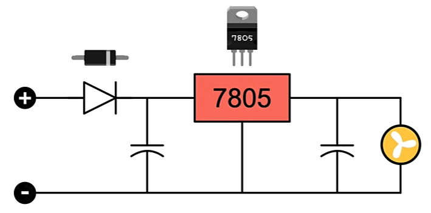
    - 钳位作用： 
        - “限制器”，重点是 “不许超过”，状态是 “平时关，超限开”。
        - 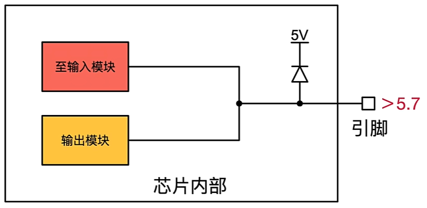
            - 当引脚电压高于5.7v时，钳位到5.7v
    - 稳压作用：
        -  “稳定器”，重点是 “保持恒定”，状态是 “持续工作在反向击穿区”。
        - 
    - 限幅
        - 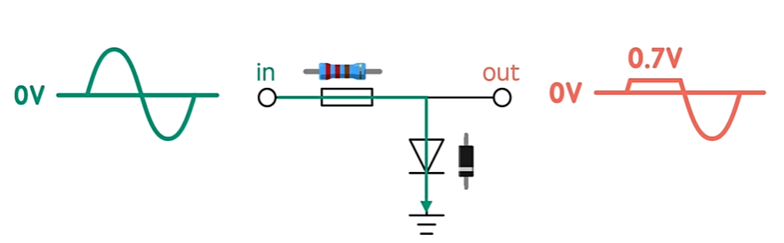
        - 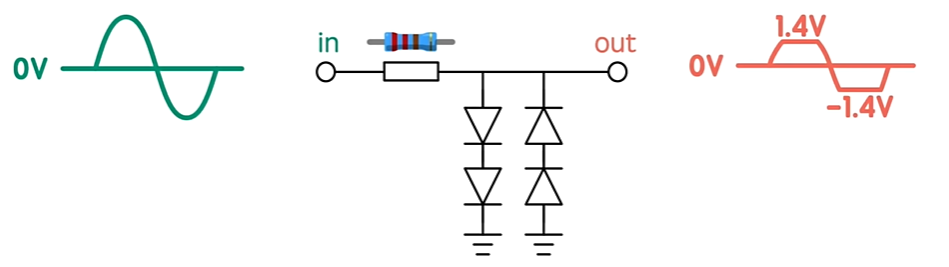
    - 检波
        - 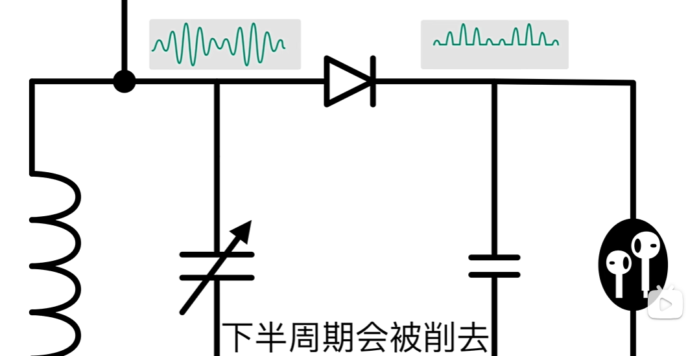
        - 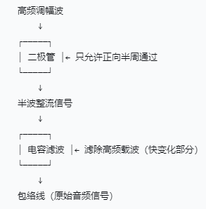
        - 是从已调制的高频信号中提取出原始低频信号的过程，比如收音机广播信号的解调。
    - 整流
        - 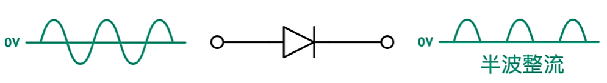
        - 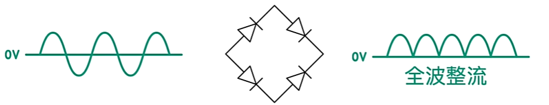
    - 续流
        - 是指在含有电感的开关电路中，当开关突然断开时，为电感储存的能量提供一条释放通路，防止产生破坏性的高压尖峰。
        - 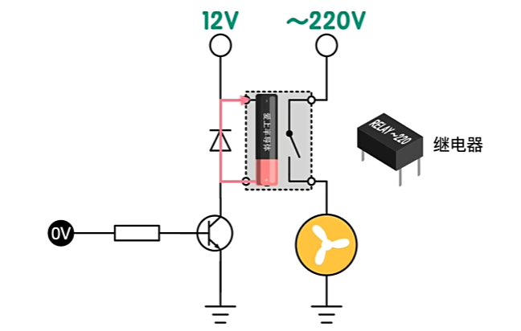
    - 倍压
        - 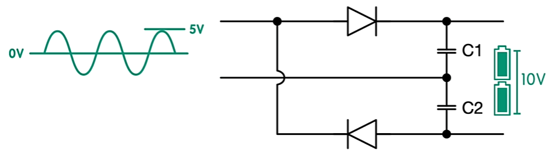
    - 逻辑门
        - 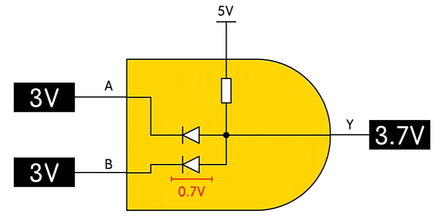
        - 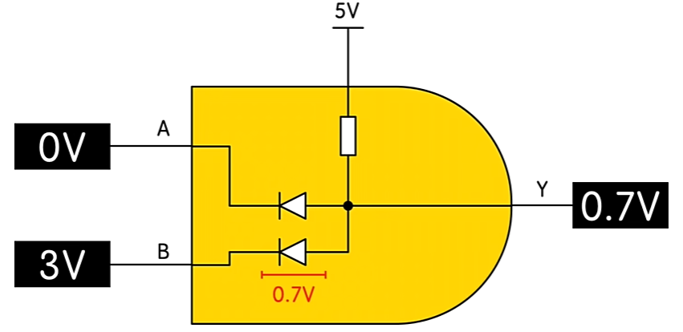

- 实操
    - 二极管单向导通
        - 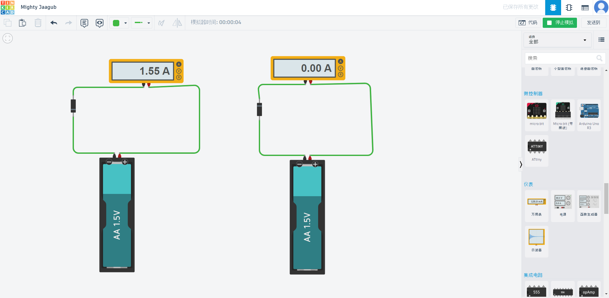
    - 稳压二极管
        - 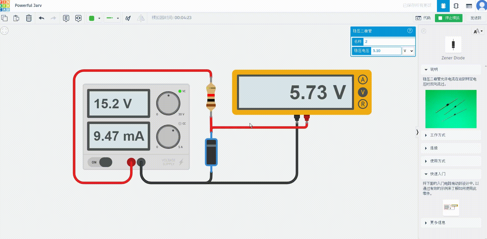
        - 电源电压即使变得很大，二极管两段压降维持在5V。通过控制半导体的掺杂浓度和制造工艺，可以制成具有不同反向击穿电压（稳压值）的二极管。

参考资料
- [模拟电子技术基础 03-PN结与二极管的特性](https://www.bilibili.com/video/BV1Gt411b7Zq?vd_source=a0ed88162ba357c3f44aa427ad89574b&spm_id_from=333.788.player.switch&p=3)
- [模拟电子技术基础 04-二极管的直流等效电路](https://www.bilibili.com/video/BV1Gt411b7Zq?vd_source=a0ed88162ba357c3f44aa427ad89574b&spm_id_from=333.788.videopod.episodes&p=4)
- [通俗讲解二极管的8个作用，高中毕业就能理解！最简单的半导体-二极管！](https://www.bilibili.com/video/BV1bi421a7HH/?vd_source=a0ed88162ba357c3f44aa427ad89574b)
- [二极管管压降为啥是0.7V？一个视频说清楚PN结原理](https://www.bilibili.com/video/BV1P5e3zGErT/)
- [3个很简单的电路，让你了解二极管的钳位作用](https://www.bilibili.com/video/BV1Ne4y1V7VR/?vd_source=a0ed88162ba357c3f44aa427ad89574b)
- [五分钟带你了解 稳压二极管](https://www.bilibili.com/video/BV1qY4y1t7sc/?spm_id_from=333.788.top_right_bar_window_history.content.click&vd_source=a0ed88162ba357c3f44aa427ad89574b)


## 发光二极管
发光二极管，简称LED，是一种能将电能直接转化为光能的半导体器件。其核心原理是电子与空穴在耗尽区附近复合时（电子和空穴在这里才能大量相遇），以可见光子形式释放能量，从而实现高效发光。


- 发光原理
    - 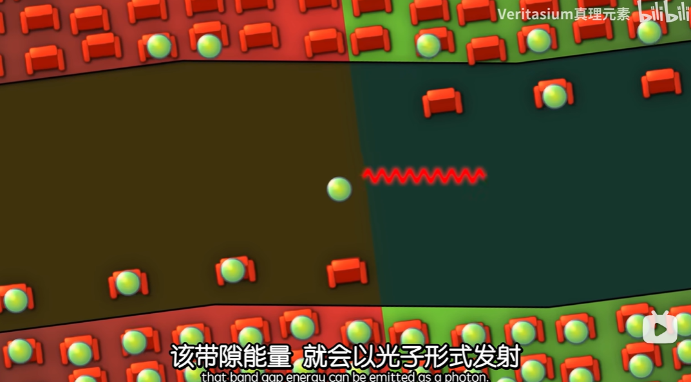
    - 当电子从导带落入价带的空穴时，该带隙能量就会以光子形式发射
    - 材质不同，光色不同：砷化镓（GaAs）发红外光，磷化镓（GaP）发红光/绿光，氮化镓（GaN）发蓝光/紫外光
    - 普通半导体材质（如硅）发射不可见红外光，能量多以热形式释放

- 实践
    - 电路图
        - 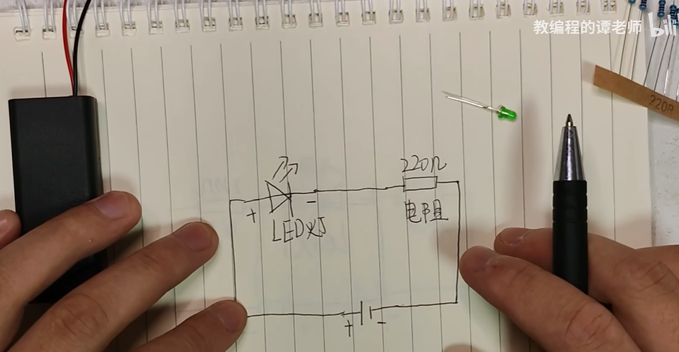
    - 仿真
        - 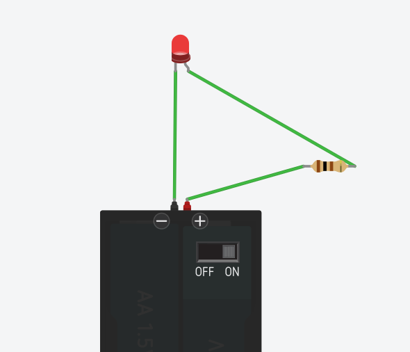
    - 实操
        - 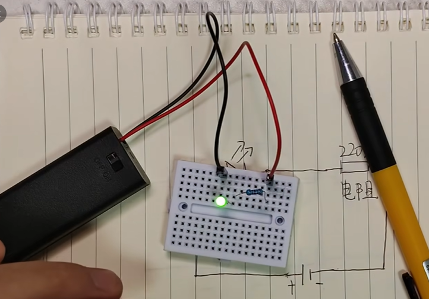

参考资料
- [为什么制作蓝LED几乎是不可能的](https://www.bilibili.com/video/BV1wi421f71U/?spm_id_from=333.788.recommend_more_video.9&trackid=web_related_0.router-related-2206419-dk9pw.1767861522260.317&vd_source=a0ed88162ba357c3f44aa427ad89574b)
- [LED灯发光原理，原来就是利用二极管](https://www.bilibili.com/video/BV1nM411N7CT/?vd_source=a0ed88162ba357c3f44aa427ad89574b)
- [面包板电路点亮led灯](https://www.bilibili.com/video/BV1k618BiEAS/?vd_source=a0ed88162ba357c3f44aa427ad89574b)


## 彩色LED
彩色LED是通过红、绿、蓝三原色芯片混合或荧光粉转换，能精准产生全彩光谱的高效发光器件。

- 单色LED
    - 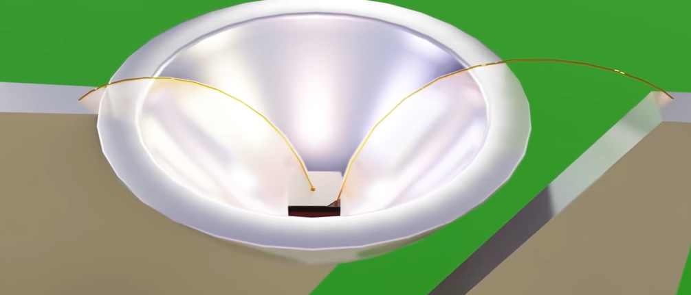
- 彩色LED
    - 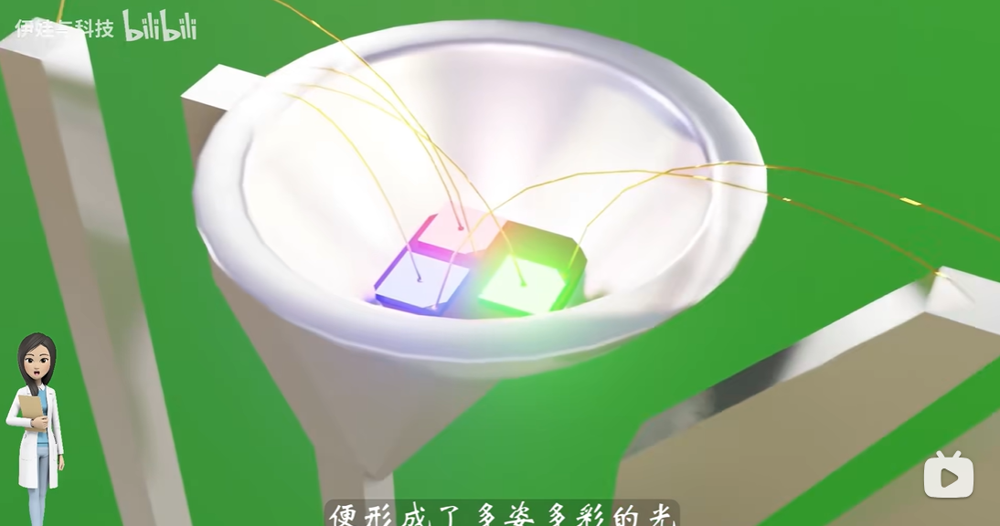
    - 上图中是共阳极接法
    - 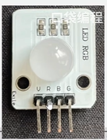
    - 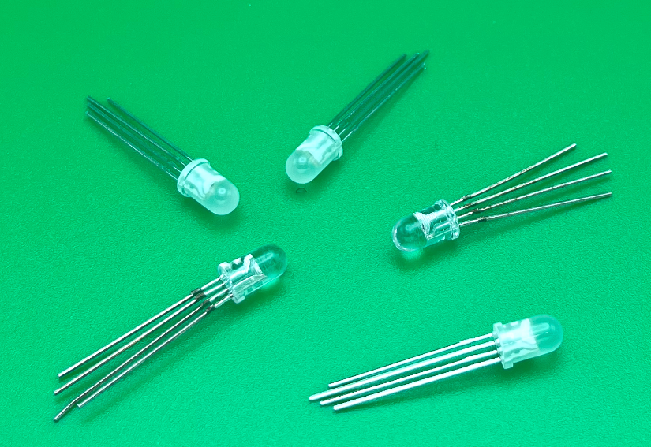

- 彩色光
    - 共阳极接法控制每个通道亮度的核心方法是：对每个通道的阴极（R, G, B引脚）分别进行独立的PWM（脉宽调制）控制。
    - 可以混合出 256^3 种颜色


- 实践
    - 注意下面是直接由开发版进行供电
    - 仿真（该元器件是共阴极）
        - 直接输出电压方式
            - 
            ```arduino
            void setup()
            {
            // 设置引脚3(G)、5(B)、6(R)为输出模式
            pinMode(3, OUTPUT);
            pinMode(5, OUTPUT);
            pinMode(6, OUTPUT);
            }

            void loop()
            {
            // 点亮绿色(G) - 引脚3
            digitalWrite(3, HIGH);
            // 点亮蓝色(B) - 引脚5  
            // digitalWrite(5, HIGH);
            // 点亮红色(R) - 引脚6
            // digitalWrite(6, HIGH);
            
            // 保持点亮状态
            // 这里没有delay，因为只需要持续点亮
            }
            ```
        - PWM方式
            - 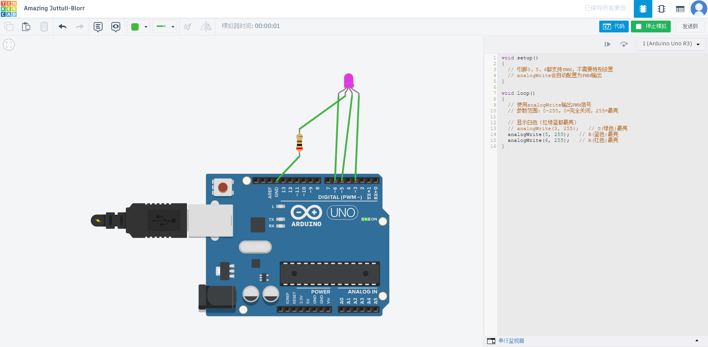
            ```arduino
            void setup()
            {
            // 引脚3、5、6都支持PWM，不需要特别设置
            // analogWrite会自动配置为PWM输出
            }

            void loop()
            {
            // 使用analogWrite输出PWM信号
            // 参数范围：0-255，0=完全关闭，255=最亮
            
            // 显示白色（红绿蓝都最亮）
            // analogWrite(3, 255);   // G(绿色)最亮
            analogWrite(5, 255);   // B(蓝色)最亮
            analogWrite(6, 255);   // R(红色)最亮
            }
            ```
    - 实操
        - 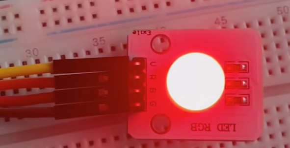
        

参考资料
- [LED灯发光原理，原来就是利用二极管](https://www.bilibili.com/video/BV1nM411N7CT/?vd_source=a0ed88162ba357c3f44aa427ad89574b)
- [RGB全彩LED基本原理及编程实现方法](https://www.bilibili.com/video/BV1MG41147cW/?vd_source=a0ed88162ba357c3f44aa427ad89574b)


## 彩色LED灯带
彩色LED灯带是在柔性基板上密集排布众多全彩LED灯珠，通过独立控制每个灯珠的红、绿、蓝三色亮度，能呈现出丰富色彩和动态效果的线性照明产品。

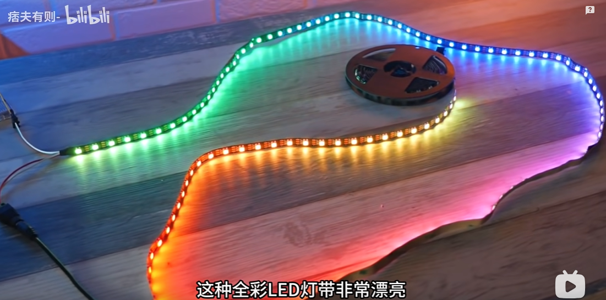

- 彩色LED灯珠大量占用PWM通道问题
    - 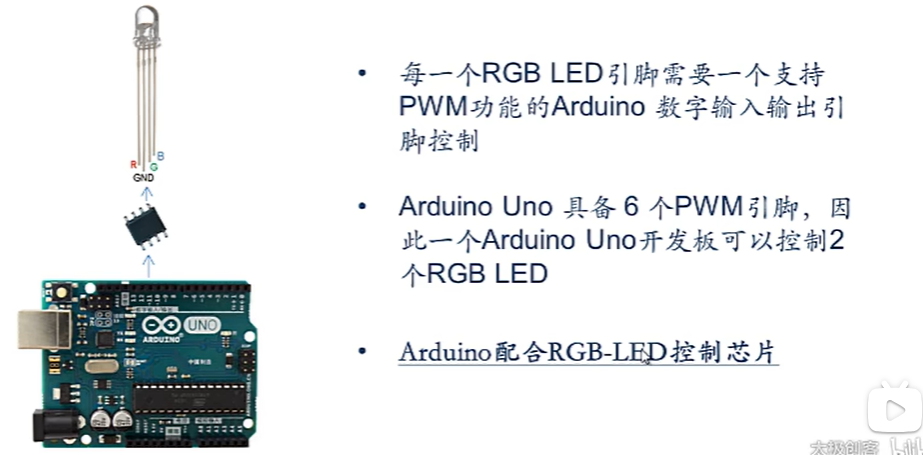
    - 减少到1个通道即可控制

- 如果灯带上有1000个灯珠呢？
    - 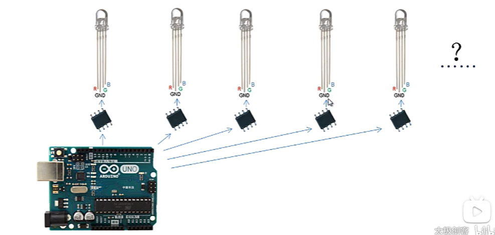
    - 可是我们的开发版没有这么多通道

- 可以考虑穿行控制
    - 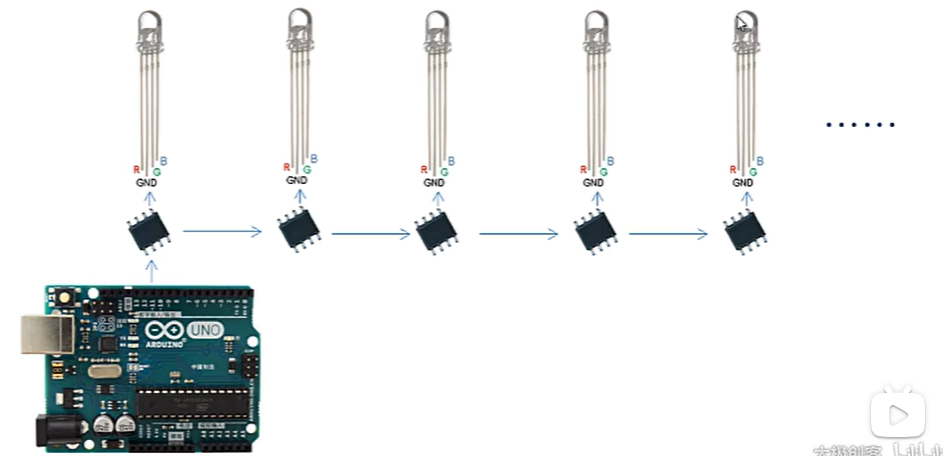
    - 也就是我们只用一个通道发出的信号，这个信号里包含着对每一个灯珠的控制，每个灯珠按照顺序去解析自己的指令，然后把剩下的指令再传给后面的灯珠。

- 数字RGB LED
    - 
    - 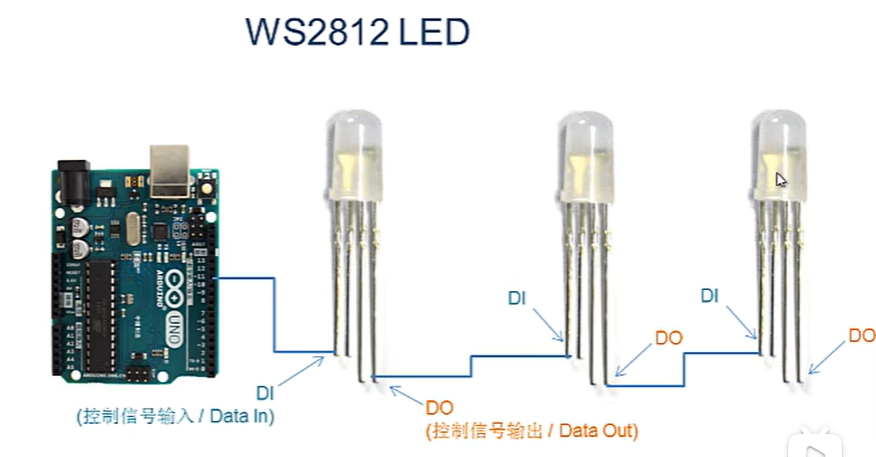
    - 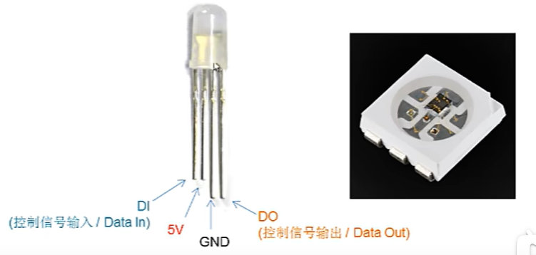
    - 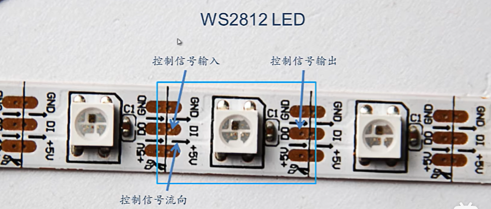
    - 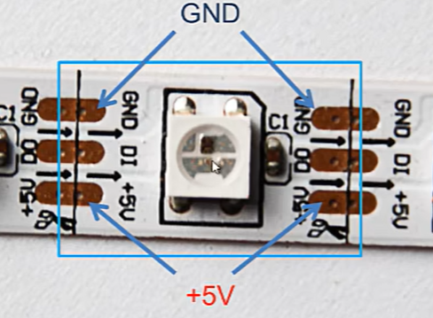
    - 
    - 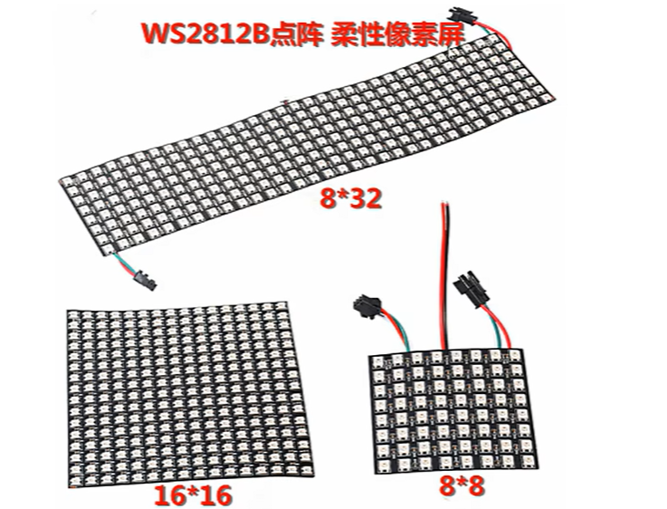


- 实践
    - 仿真
        - 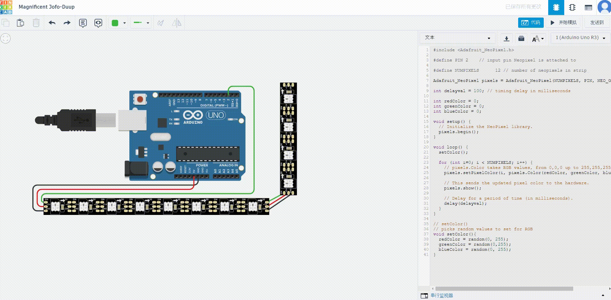
        
        ```arduino
        #include <Adafruit_NeoPixel.h>

        #define PIN 2	 // input pin Neopixel is attached to

        #define NUMPIXELS      12 // number of neopixels in strip

        Adafruit_NeoPixel pixels = Adafruit_NeoPixel(NUMPIXELS, PIN, NEO_GRB + NEO_KHZ800);

        int delayval = 100; // timing delay in milliseconds

        int redColor = 0;
        int greenColor = 0;
        int blueColor = 0;

        void setup() {
        // Initialize the NeoPixel library.
        pixels.begin();
        }

        void loop() {
        setColor();

        for (int i=0; i < NUMPIXELS; i++) {
            // pixels.Color takes RGB values, from 0,0,0 up to 255,255,255
            pixels.setPixelColor(i, pixels.Color(redColor, greenColor, blueColor));

            // This sends the updated pixel color to the hardware.
            pixels.show();

            // Delay for a period of time (in milliseconds).
            delay(delayval);
        }
        }

        // setColor()
        // picks random values to set for RGB
        void setColor(){
        redColor = random(0, 255);
        greenColor = random(0,255);
        blueColor = random(0, 255);
        }
        ```
        

参考资料
- [零基础入门学用 Arduino 教程 - 智能应用篇 19-26 WS2812LED智能灯带及FastLED库应用](https://www.bilibili.com/video/BV1DW411u7om?spm_id_from=333.788.videopod.episodes&vd_source=a0ed88162ba357c3f44aa427ad89574b)
- [颠覆认知！WS2812彻底改变了灯光玩法！一根线如何操控千颗LED？](https://www.bilibili.com/video/BV1c9fhY5EPk/?vd_source=a0ed88162ba357c3f44aa427ad89574b)


## 电阻器
用于限制电流、调节电压并消耗电能的线性无源元件，是控制电路基本参数的基础器件。

- 电流的定义
    - 电流是单位时间内通过导体某一横截面的电荷量。

- 电阻限制电流的微观原理
    - 电场驱动的定向电子流因不断与材料热振动的原子发生碰撞而减速，这种碰撞频率决定了电阻值的大小，并伴随电能向热能的转化。
    - 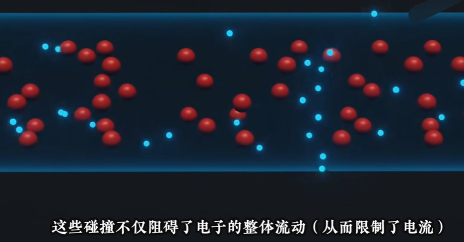

- 电阻大小的影响因素
    - 材料本身：电阻率（ρ）
    - 几何尺寸：长度（L）与横截面积（A）
        - 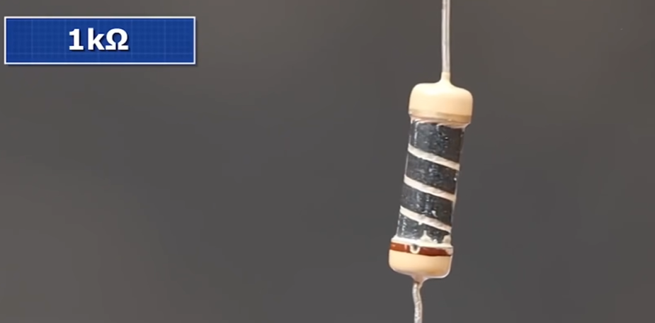
        - 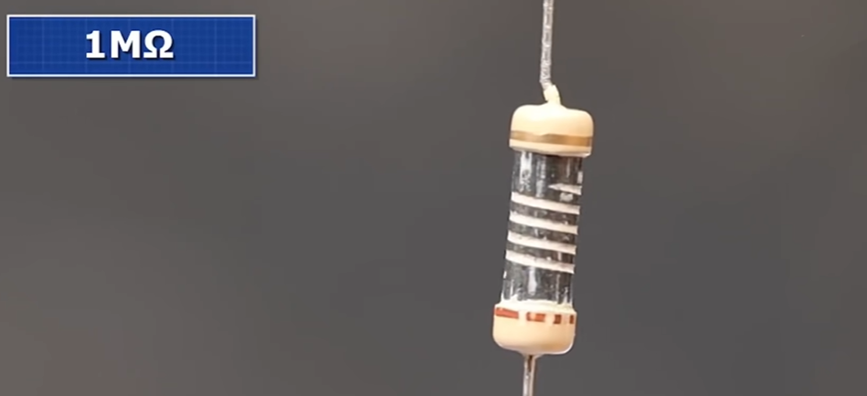
    - 温度（T）

- 电阻的功率
    - 电阻的表面积越大，散热越快，额定功率也就越大
    - 

- 插件电阻的色环编码系统
    - 
    - 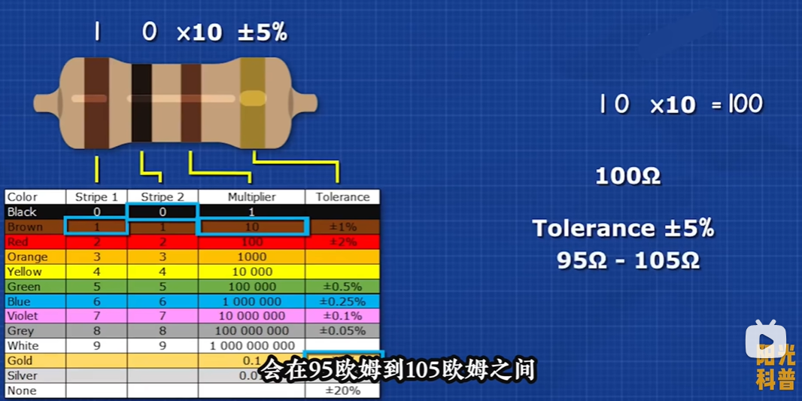

- 贴片电阻
    - SMD电阻（Surface Mount Device Resistor，表面贴装器件电阻）
    - 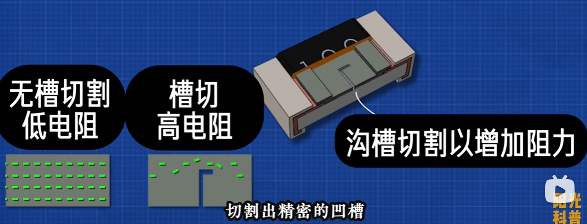

- 贴片电阻的编码系统
    - 3位编码
        - 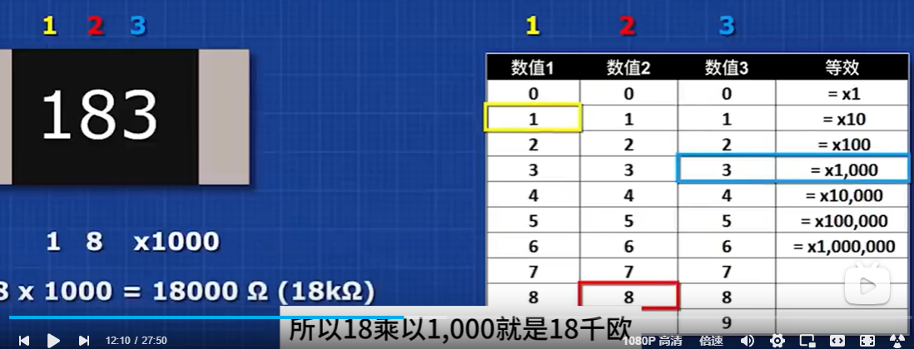
    - 4位编码
        - 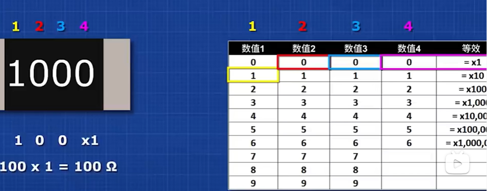

- 实操
    - 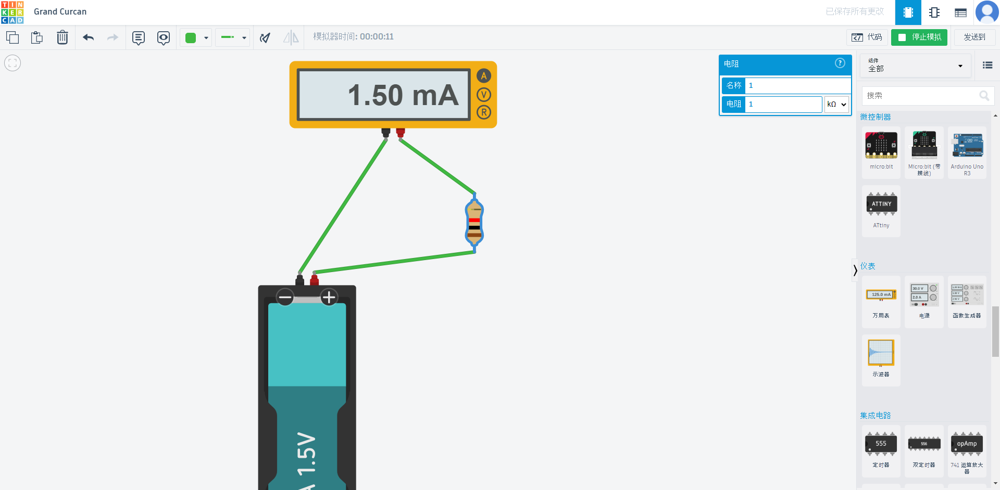

参考资料
- [一口气带你搞懂电阻的工作原理](https://www.bilibili.com/video/BV1weebzpEBB/?vd_source=a0ed88162ba357c3f44aa427ad89574b)
- [电阻是如何工作的 ？电阻工作原理解密！](https://www.bilibili.com/video/BV1nb421b7hy/?vd_source=a0ed88162ba357c3f44aa427ad89574b)


## 电位器
电位器是一种连续可调的电阻器，通过改变滑动触点与固定电阻体之间的有效接触长度来调节电阻值。

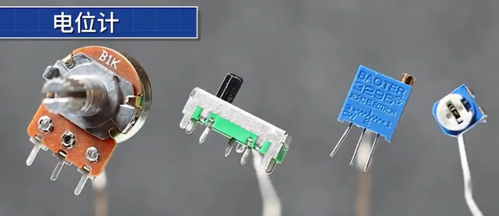
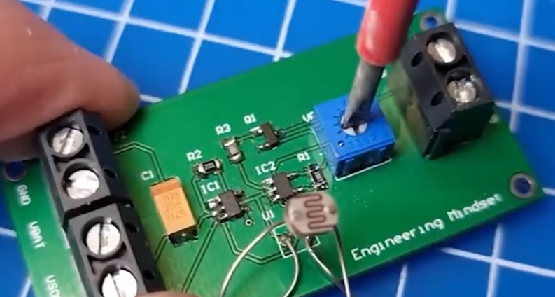


- 变阻原理
    - 只使用中间触点和边缘触点作为一个变阻器
        - 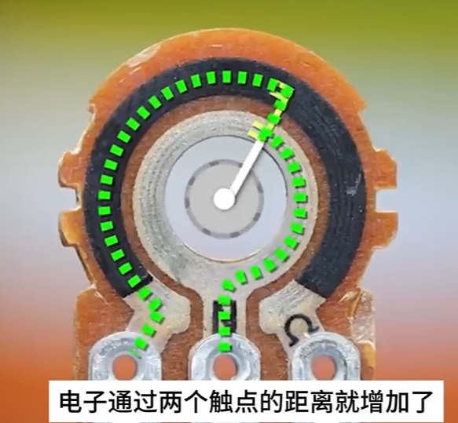
    - 使用三个触点输出指定电压
        -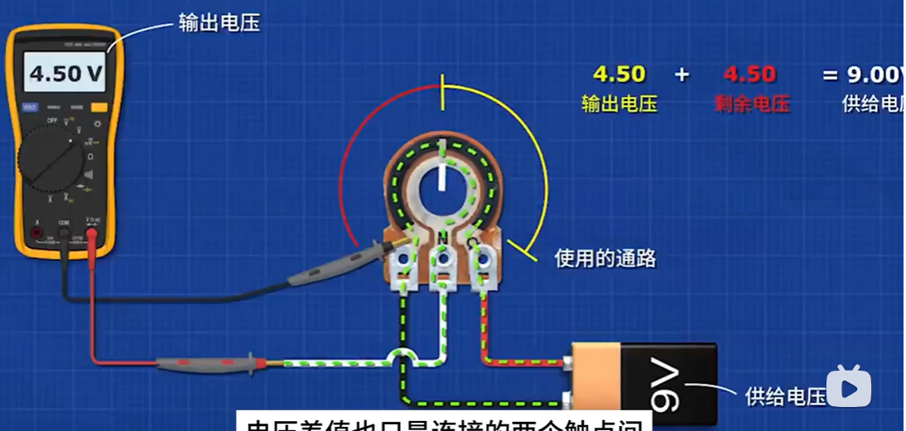

- 电位计的阻值编码
    - 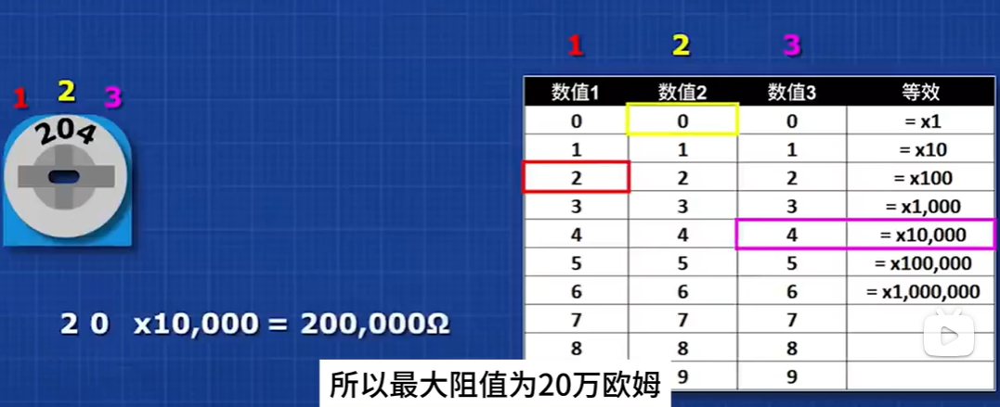

- 实操
    - 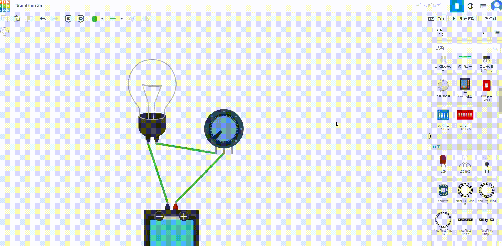
    
参考资料
- [一口气带你搞懂电阻的工作原理](https://www.bilibili.com/video/BV1weebzpEBB/?vd_source=a0ed88162ba357c3f44aa427ad89574b)
- [电阻是如何工作的 ？电阻工作原理解密！](https://www.bilibili.com/video/BV1nb421b7hy/?vd_source=a0ed88162ba357c3f44aa427ad89574b)


## 电容器
电容器是一种能存储和释放电荷的储能元件，通过两块导体间夹一层绝缘介质构成，具有隔直流、通交流的特性。

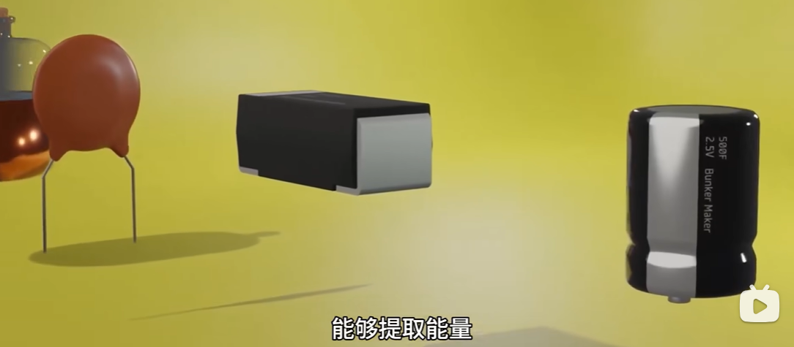

- 陶瓷电容器（扁豆电容器）
    - 
    - 
    - 两个金属圆盘 + 一个陶瓷圆盘作为电介质

- 电容器的原理
    - 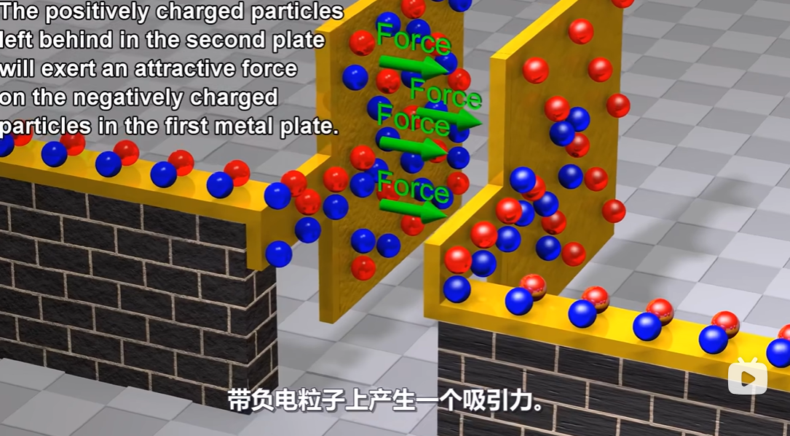
    - 电源正极 → 从电容器的正极板持续抽出电子。
    - 电源负极 → 向电容器的负极板持续堆积电子。
    - 两极板上的异性电荷建立起一个从正极板指向负极板的均匀电场。
    - 当电容器两极板间的电压 U_c 上升到与电源电压 V 完全相等时，电荷停止移动，电流变为零。
    - 充电完成后，电容器像一个 “微型电池”，将能量以电场能的形式储存在两极板间的电场中。

- 电容的定义式和决定式
    - 电容的定义式
        - $$C = \frac{Q}{U}$$
        - 含义：电容器所带的电荷量 Q 与两极板间的电势差 U 的比值，定义为该电容器的电容 C
        - 定义式**并没有揭示**电容 C 的大小由哪些物理因素决定。它只是告诉我们如何量化和计算电容。

    - 电容的决定式（以平行板电容器为例）
        - $$C = \frac{\varepsilon_r \varepsilon_0 S}{d}$$
        - S: 两极板的正对面积
        - d: 两极板间的距离
        - $ε_r$: 两极板间电介质的相对介电常数
        - $ε_0$: 真空介电常数
        - 这是一个决定式，它揭示了电容大小的内在决定因素。
        - 电容是电容器自身的属性，与它是否带电、带多少电、两端电压多大无关（类似于电阻是导体本身的属性，与是否通电无关）。


- 电容值的决定因素
    - **面积**：两极板正对的有效面积越大，能“盛放”的电荷越多，电容越大。
    - **距离**：两极板间的距离越近，正负电荷间的吸引力越强，在相同电压下能吸引更多的电荷，电容越大。
    - **电介质**：加上电介质后，它会减弱板上同种电荷的排斥，使更多电荷能聚集在板面，从而增大电容。

- 电容的极性
    - 电容分两种 —— 有极性的（电解电容）和没极性的（陶瓷、薄膜电容）。
    - 有极性电容的优势：用很小的体积，就能做到超大容量。代价就是必须注意正负极，不能接反。

- 实操
    - 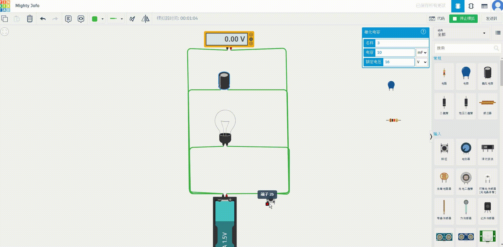

参考资料
- [电容结构及原理](https://www.bilibili.com/video/BV1C34y1N7Lb/?vd_source=a0ed88162ba357c3f44aa427ad89574b)
- [电容器的原理](https://www.bilibili.com/video/BV11741127TT/?vd_source=a0ed88162ba357c3f44aa427ad89574b)
- [【物理实验】探究平行板电容器电容的影响因素](https://www.bilibili.com/video/BV1zV411j7KG/?vd_source=a0ed88162ba357c3f44aa427ad89574b)
- [71-电解电容为什么分正负极？反接会有什么后果？热了赶紧换](https://www.bilibili.com/video/BV1Yy4y1G7yF/?vd_source=a0ed88162ba357c3f44aa427ad89574b)


## 电感器
电感器是一种利用通电导体周围产生磁场来储存磁场能量、并对电流变化产生阻碍作用的元件，具有“通直流、阻交流”的特性。

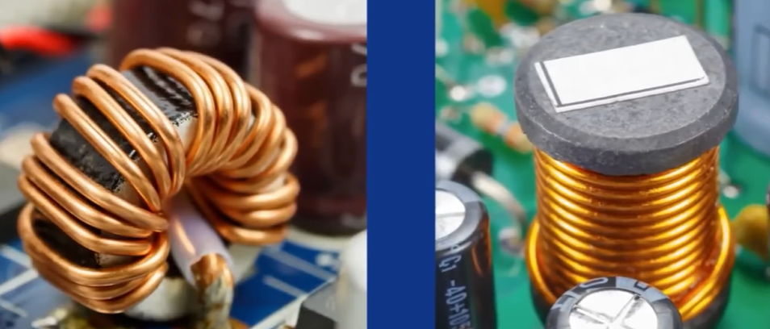

- 原理
    - 根据安培定律，当导体中有电流通过时，导体周围会产生磁场；线圈中的电流越大，产生的磁场越强。
        - 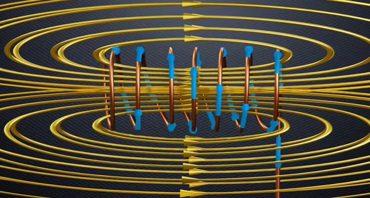
    - 当电流发生变化时，线圈中的磁通量随之变化，根据法拉第电磁感应定律，线圈中会产生感应电动势（自感现象）。
        - 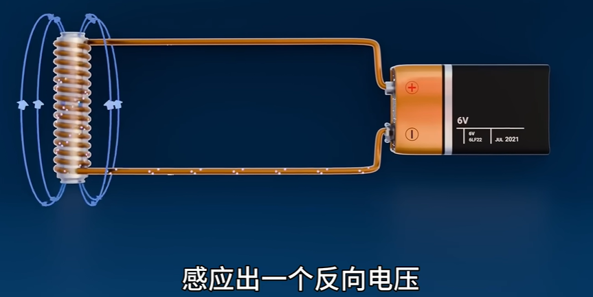
    - 该感应电动势的方向总是阻碍原电流变化（楞次定律），从而表现为对电流变化的阻碍作用。
    - 电感器正是利用这种磁场储能和电磁感应效应来工作，其储存的能量以磁场能的形式存在。

- 简单电路
    - 刚接通电流无法通过电感
        - 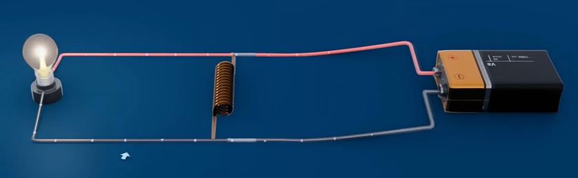
    - 电感磁通量不在变化，通直流
        - 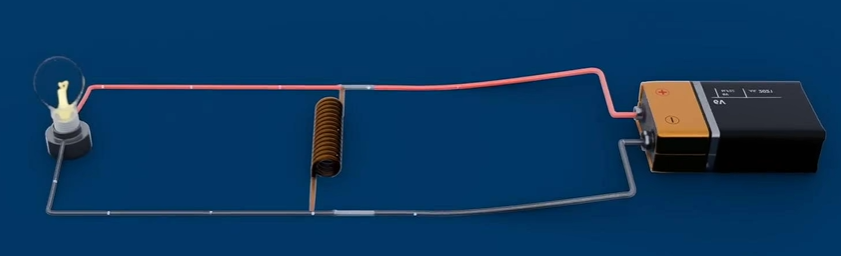
    - 断开电路，电流发生瞬间变化，磁通量继续变化，产生电动势给灯泡供电。
        - 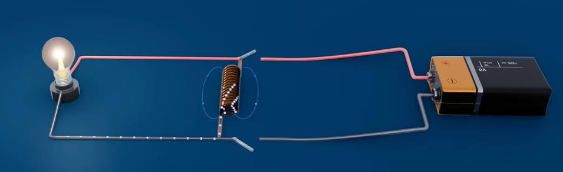

- 实操
    - 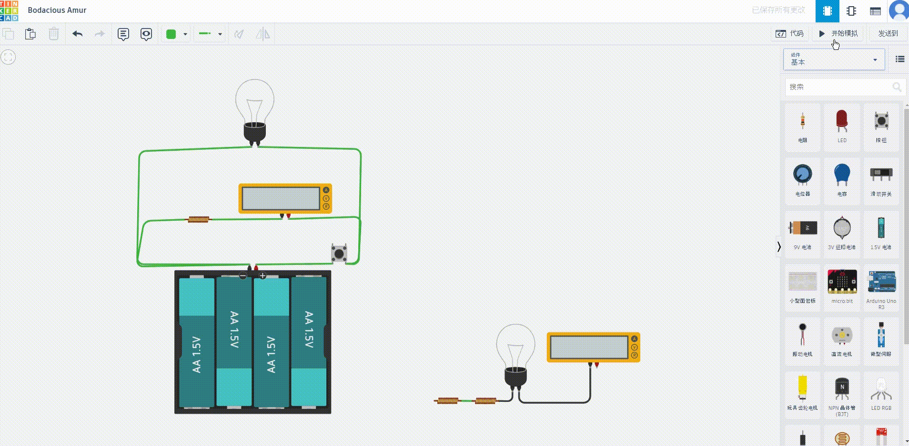

参考资料
- [学校三年没整明白的电感器原理，其实就这么简单！](https://www.bilibili.com/video/BV1evJaz7EsK/?spm_id_from=333.337.search-card.all.click&vd_source=a0ed88162ba357c3f44aa427ad89574b)
- [电感在电路中起什么作用的，它的工作原理是什么？](https://www.bilibili.com/video/BV1DJrvBDEE8/?spm_id_from=333.337.search-card.all.click&vd_source=a0ed88162ba357c3f44aa427ad89574b)


## 温湿度传感器
测量环境温度和湿度的传感器

参考资料
- [零基础入门学用 Arduino 教程 - 智能应用篇 19-26 WS2812LED智能灯带及FastLED库应用](https://www.bilibili.com/video/BV1DW411u7om?spm_id_from=333.788.videopod.episodes&vd_source=a0ed88162ba357c3f44aa427ad89574b)


## 气压传感器
测量大气压力的传感器

## 光照传感器
检测环境光照强度的传感器

## 颜色传感器
识别物体颜色的传感器

## 紫外线传感器
检测紫外线强度的传感器

## 运动传感器
检测物体运动的传感器

## 姿态传感器
检测物体空间姿态的传感器

## 振动传感器
检测机械振动的传感器

## 距离传感器
测量物体距离的传感器

## 接近传感器
检测物体接近的传感器

## 存在传感器
检测人体或物体存在的传感器

## 气体传感器
检测特定气体浓度的传感器

## 空气质量传感器
检测空气质量的传感器

## 粉尘传感器
检测空气中粉尘颗粒的传感器

## 触摸传感器
电容式触摸传感器

## 压力传感器
测量压力的传感器

## 力传感器
测量力的传感器

## 重量传感器
测量重量的传感器

## 流量传感器
测量流体流量的传感器

## 液位传感器
测量液体高度的传感器

## 湿度传感器
测量环境湿度的传感器

## 土壤传感器
检测土壤参数的传感器

## 声音传感器
检测声音的传感器

## 磁场传感器
检测磁场的传感器

## 电流传感器
测量电流的传感器

## 电压传感器
测量电压的传感器

## 功率传感器
测量功率的传感器

## 心率传感器
测量心率的传感器

## 血氧传感器
测量血氧饱和度的传感器

## GPS模块
全球定位系统模块

## 陀螺仪
测量角速度的传感器

## 加速度计
测量加速度的传感器

## 磁力计
测量磁场强度的传感器

## 红外传感器
红外线传感器

## 激光传感器
激光测距和检测传感器

## 雷达传感器
雷达检测传感器

## 摄像头模块
图像采集模块

## 编码器
旋转编码器

## 直流电机
直流电动机

## 步进电机
步进电动机

## 舵机
舵机马达

## 振动电机
振动马达

## 继电器
电磁继电器

## 电磁铁
电磁铁执行器

## LED灯
发光二极管

## OLED显示屏
有机发光二极管显示屏

## LCD显示屏
液晶显示屏

## 数码管
七段数码管

## 蜂鸣器
发声蜂鸣器

## 扬声器
音频扬声器

## 麦克风
声音采集麦克风

## 蓝牙模块
蓝牙通信模块

## WiFi模块
无线网络模块

## LoRa模块
远距离无线模块

## ZigBee模块
ZigBee无线模块

## NB-IoT模块
窄带物联网模块

## 4G模块
4G通信模块

## RFID模块
射频识别模块

## NFC模块
近场通信模块

## 红外通信
红外通信模块

## 以太网模块
有线网络模块

## CAN总线模块
控制器局域网模块

## RS485模块
RS485通信模块

## ADC模块
模数转换模块

## DAC模块
数模转换模块

## 运算放大器
运算放大器芯片

## 比较器
电压比较器

## 电压基准
基准电压源

## 电源管理
电源管理芯片

## 电池管理
电池管理芯片

## 升压模块
升压转换器

## 降压模块
降压转换器

## 稳压模块
电压稳压器

## 光耦隔离
光电耦合器

## 电平转换
电平转换芯片

## 信号调理
信号调理电路

## 滤波器
信号滤波器

## 放大器
信号放大器

## 计数器
数字计数器

## 定时器
定时器芯片

## 时钟模块
实时时钟模块

## 存储模块
存储器模块

## 逻辑芯片
数字逻辑芯片

## 微控制器
微控制器芯片

## 开发板
开发板平台

## 扩展板
功能扩展板

## 转接板
接口转接板

## 连接器
电子连接器

## 线缆
连接线缆

## 散热器
散热装置

## 外壳
设备外壳
